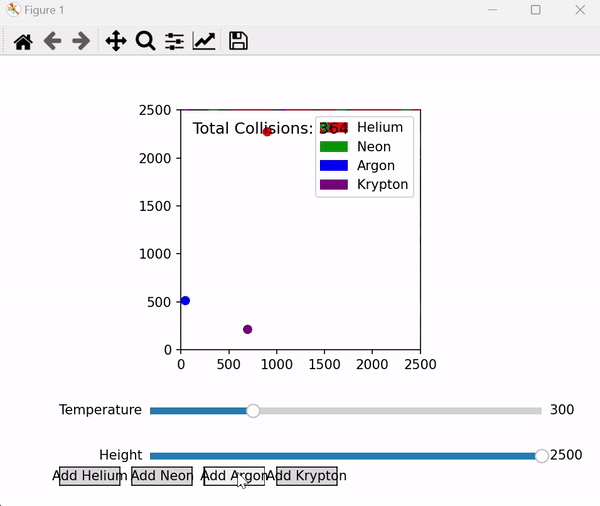

# Ideal Gas Simulation

A simple visualization of noble gas particles in a 2D system, demonstrating ideal gas behavior.



## Features

- **Temperature Control**: Adjust particle speeds.
- **Height Adjustment**: Change system dimensions.
- **Add Particles**: Introduce Helium, Neon, Argon, and Krypton.
- **Collision Counter**: Tracks and displays collisions.

## Installation

1. Install dependencies:
    ```bash
    pip install numpy matplotlib scipy
    ```
2. Run the simulation:
    ```bash
    python visualization.py
    ```

## License

MIT License.
